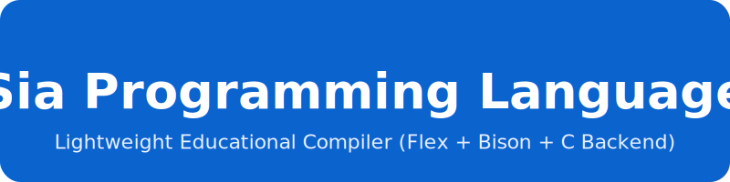

<p align="center">
  
</p>

---

# 👥 Team Members
<div style="display:flex; flex-wrap:wrap; gap:10px;">

<div style="background:#e8f1ff; padding:8px 12px; border-radius:8px;">Md Abdullah Himel — 1622</div>
<div style="background:#e8f1ff; padding:8px 12px; border-radius:8px;">Md Labib Ahmed Leo — 1147</div>
<div style="background:#e8f1ff; padding:8px 12px; border-radius:8px;">Zabir Bin Abu Bakar — 4752</div>
<div style="background:#e8f1ff; padding:8px 12px; border-radius:8px;">Poritos Das — 1736</div>
<div style="background:#e8f1ff; padding:8px 12px; border-radius:8px;">Mysha Milon Ohana — 1039</div>

</div>

---

# 📘 Overview
Sia -> Simple, Interpretable, Analyzer  <br>
**Sia** (Syntax Interpreter & Analyzer) is a small, Python-inspired educational programming language created to illustrate every fundamental stage of compiler construction using:

- **Flex** — lexical analysis  
- **Bison** — parsing  
- **C backend** — code generation  

Sia supports a simple imperative structure, type inference, clean expressions, and essential control flow constructs, making it ideal for learning compiler design principles.

---

# ✨ Core Features
- **Primitive Types:** INT, FLOAT, STR, Boolean  
- **Type System:** explicit typing + automatic type inference  
- **Expressions:** +, −, *, /, relational ops, parentheses  
- **Control Flow:** `IF/ELSE`, `WHILE`  
- **I/O:** `GET var;`, `SHOW expr;`  
- **Full Compiler Pipeline:**  
  Flex → Bison → AST → Semantic Analysis → C Code Generation  

---

# ⚙️ Getting Started

### Prerequisites
Install the following:

- `flex`
- `bison`
- `gcc` or `clang`
- `Python 3.x`

### Ways to run a SIA program

--- Python approach ---
```bash
# Compile the Sia code to C
python sia_compiler.py studentMarksCalc.sia

# Compile C to executable
gcc -o studentMarksCalc.exe studentMarksCalc.c

# Run the program
.\studentMarksCalc.exe
```

### Or, use the batch file (one command)
```bash
.\run_sia.bat studentMarksCalc.sia


--- C approach ---
```bash
flex -o lex.yy.c src/lexer.l
bison -d -o src/parser.tab.c src/parser.y
gcc -Iinclude src/*.c lex.yy.c src/parser.tab.c -o sia_compiler
```
